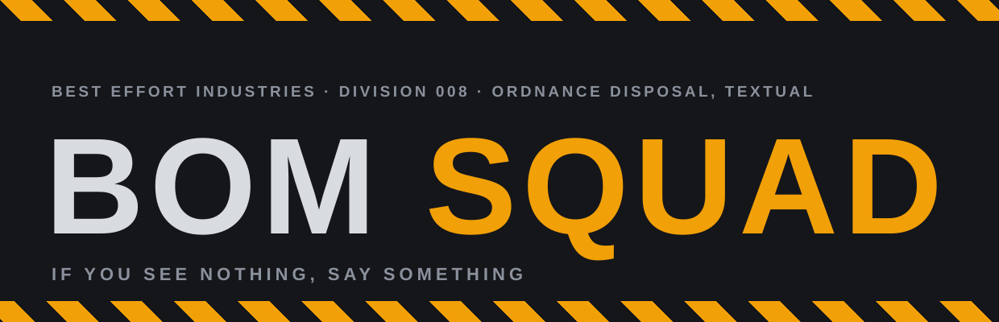

<p align="center">
  
</p>

<p align="center">
  <strong>Invisible character disposal since U+FEFF.</strong><br>
  If you can see the problem, it is not our department.
</p>

---

This repository contains the public site for BOM SQUAD (bomsquad.dev,
candidate domain, not yet purchased), the explosive ordnance disposal
contractor for characters you cannot see: byte order marks, zero width
spaces, bidirectional overrides, and the rest of the material a word
processor leaves behind in your code.

## The Unit

The squad responds to any text that "looks fine" but is not fine. We locate
concealed ordnance, publish a full incident report, and, on your order,
render the scene safe. All disposal is performed locally in your browser at
a safe distance from our servers, which do not exist. Certificates of
disposal are issued on completion and are legally binding on no one. Our
record stands at over two million characters neutralized with zero visible
results, a figure we report with pride, since visible results would mean we
had removed the wrong characters.

## What the tool actually does

The scanner and the render-safe tool on the site are real, client-side, and
factual. Disposal orders, by codepoint:

| Codepoint | Name | Disposal order |
| --- | --- | --- |
| U+FEFF | Byte order mark | Removed |
| U+200B | Zero width space | Removed |
| U+200C | Zero width non-joiner | Removed |
| U+200D | Zero width joiner | Removed |
| U+2060 | Word joiner | Removed |
| U+202D | Left-to-right override | Removed |
| U+202E | Right-to-left override | Removed |
| U+00AD | Soft hyphen | Removed |
| U+00A0 | No-break space | Replaced with a plain space |
| U+2018, U+2019 | Smart single quotes | Replaced with a straight apostrophe |
| U+201C, U+201D | Smart double quotes | Replaced with a straight double quote |
| U+2011 | Non-breaking hyphen | Replaced with a plain hyphen |
| U+2014 | Em dash | Reported, left in place |

## Warning: this repo is a live range

**`index.html` intentionally contains escape sequences for invisible
characters.** The "load a training sample" button injects U+FEFF, zero
widths, a no-break space, and friends into the textarea via `\uXXXX`
escapes in the inline script. Those escapes are plain ASCII and must stay
exactly as written. Do not run the file through a formatter, normalizer,
or "cleanup" tool that rewrites string literals; defusing the training
sample defeats the training.

The escapes are the only invisible material on the premises. The repo
itself contains no literal BOM and no literal invisible characters, a claim
the site footer makes and `make verify` (`tools/verify.py`) enforces. The
same sweep enforces house style outside `index.html`: straight quotes, no
em dashes. The literal em dash and smart quotes inside `index.html` are
exhibits in the field guide and are supposed to be there.

---

## Development notes

The parody ends here. The rest of this file is accurate.

### Layout

A static, zero-build, zero-dependency site. Two HTML files and a handful of
generated images. There is no framework, no bundler and no `package.json`.
Cloudflare Pages serves the repository root exactly as it appears here.

```
index.html            the site, scanner and render-safe tool included
404.html              catch-all, served automatically by Cloudflare Pages
favicon.svg           icon source of truth (64px grid)
favicon.ico           16/32/48, generated
apple-touch-icon.png  180x180, generated
og.png                1200x630 share image, generated
assets/logo.svg       wordmark, text outlined, used at the top of this README
tools/og.html         source for og.png
tools/logo-src.svg    source for assets/logo.svg, text still live
tools/favicon-16.svg  pixel-grid 16px icon, used for the smallest .ico entry
tools/verify.py       invisible-character sweep, run by `make verify`
Makefile              asset regeneration only, never runs at deploy time
_headers              Cloudflare Pages header rules
robots.txt            permissive
wrangler.toml         Cloudflare Pages configuration
```

The page makes zero requests to any external domain. Type is Helvetica
Neue with Arial and generic sans fallbacks, so there are no webfonts to
host or wait for.

### The production domain

`bomsquad.dev` is a candidate; the domain has not been purchased. It is
hardcoded, deliberately, in three places, and nothing derives it from
anything else:

| File | What to change |
| --- | --- |
| `index.html` | `rel=canonical`, `og:url`, `og:image`, `twitter:image` |
| `404.html` | nothing, the 404 uses only root-relative paths |
| `tools/og.html` | the domain printed in the footer of the share image |
| `README.md` | this table, and the mentions above it |

After changing `tools/og.html`, re-run `make og`.

### Local preview

```sh
make serve          # python3 -m http.server 8000
```

Then open `http://localhost:8000`. A local server is preferable to opening
the file directly because the icon paths are root-absolute.

### Regenerating images

Only needed when the tagline, the wordmark or the icon changes. Requires
`google-chrome`, ImageMagick 7 (`magick`) and Inkscape on the machine doing
the regenerating; none of them is needed to deploy, because the outputs are
committed.

```sh
make assets         # everything below
make og             # og.png     <- tools/og.html, via headless Chrome
make favicon        # favicon.ico + apple-touch-icon.png <- the SVG sources
make logo           # assets/logo.svg <- tools/logo-src.svg, text outlined
```

`make logo` outlines the wordmark's text so the README renders the same
whether or not the viewer has Liberation Sans or Arial. Inkscape rewrites
the whole file, so the `GENERATED` comment at the top has to be pasted back
afterwards.

`make og` screenshots `tools/og.html` at exactly 1200x630 and quantises the
result. If you change the tagline in `index.html`, change it in
`tools/og.html` too and re-run `make og`; nothing links the two
automatically.

On Linux, Helvetica Neue and Arial resolve through fontconfig to Liberation
Sans, which is metric-compatible with Arial. The rendered `og.png`
therefore matches what most non-Apple viewers see in the browser.

### Verifying the premises

```sh
make verify         # python3 tools/verify.py
```

Exits non-zero if any text file in the repo contains a literal invisible
character, or an em dash or smart quote outside `index.html`. Run it after
any edit to `index.html`; editors that "helpfully" insert a BOM are exactly
the sort of device this site was formed to dispose of, and it would be
embarrassing.

### Deploying

Wrangler is configured via `wrangler.toml`, so a deploy is one command from
an authenticated shell:

```sh
make deploy         # wrangler pages deploy .
```

### Which Cloudflare account this deploys to

This machine has two Cloudflare identities, and picking the wrong one
deploys this site into an unrelated organisation.

**Pages configuration cannot pin the account.** `account_id` is a
Workers-only key; putting it in a Pages `wrangler.toml` makes Wrangler
refuse to run:

```
Configuration file for Pages projects does not support "account_id"
```

So the account is selected by **an auth profile bound to this directory**,
recorded in `~/.config/.wrangler/profiles/directory-bindings.json`:

```sh
wrangler auth activate personal    # already done; re-run after moving the repo
wrangler whoami                    # must print: Active profile: personal
```

Without a binding, Wrangler falls back to the `default` profile, which here
is the other organisation, and it will deploy there without asking. **Check
`whoami` before deploying.** The binding lives outside the repo, so a fresh
clone, a moved directory, or another machine all need
`wrangler auth activate` again.

One extra trap: Wrangler caches the resolved account in the untracked
`.wrangler/cache/wrangler-account.json` inside this directory. If a deploy
ever went to the wrong account from here, activating the right profile is
**not** enough; delete `.wrangler/` as well, or the cached account ID wins
and the API call fails with `Authentication error [code: 10000]`.

For CI, where profiles do not exist, set `CLOUDFLARE_ACCOUNT_ID` (the
account to deploy into) and `CLOUDFLARE_API_TOKEN` (credentials scoped to
it) as environment variables.

The Pages project is `bomsquad`, production branch `main`, with no build
command and the build output directory set to `/`. If you ever recreate it
from the dashboard, use exactly those values; there is nothing to build,
and any build command entered there will only make the deployment worse.

To wire the Git integration instead, connect the `holthe/bom-squad`
repository under **Workers & Pages -> Create -> Pages -> Connect to Git**
with the same settings. Note that the repository name is hyphenated and the
Pages project name is not; the project name matches the domain.

### Custom domain

Deploy at least once first, so the project exists. Then, once
`bomsquad.dev` (or whatever the site ends up on) is actually registered:

1. **Add the zone to Cloudflare**, unless the domain was bought through
   Cloudflare, in which case it is already there. Dashboard -> **Add a
   site** -> the domain -> Free plan. Repoint the registrar's nameservers
   at the two Cloudflare ones and wait for the zone to go active.
2. **Attach the domain to the Pages project.** Dashboard -> **Workers &
   Pages** -> `bomsquad` -> **Custom domains** -> **Set up a custom
   domain**. Because the zone is on Cloudflare, the required CNAME record
   (apex, flattened, proxied, pointing at `bomsquad.pages.dev`) is created
   for you. **Do not create the record by hand first**; a pre-existing
   CNAME blocks the flow outright.
3. **Repeat for `www`** if both should resolve.
4. **Wait for the certificate.** Issuance normally completes within a few
   minutes of the record appearing.

Until then the site is reachable at `bomsquad.pages.dev`.

### Related

BOM SQUAD is a division of
[Best Effort Industries](https://besteffortindustries.com), currently
queued in that register's Schedule B under a provisional number. Real
division numbers are assigned by the register on entry into service and
are recorded nowhere else, including here, where a copy would only go
stale and then off.

## License

Parody. The squad does not exist, the ordnance is real, and only one of
those facts should worry you.
